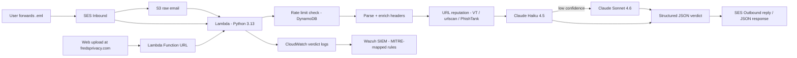

# Phish Analyzer

Serverless phishing email analyzer. Forward a suspicious email — or drop the `.eml` on the web page — and get back a structured verdict with confidence score, indicators of compromise, and a recommendation in under ten seconds.

Combines deterministic header analysis (SPF, DKIM, DMARC, URL extraction, sender alignment, lookalike-domain detection, HTML link-mismatch detection), threat-intelligence URL reputation (VirusTotal, urlscan.io, PhishTank), and LLM-based content review with hybrid model routing (Claude Haiku 4.5, escalating to Sonnet when unsure). Verdict telemetry flows to CloudWatch and into Wazuh with MITRE ATT&CK-mapped detection rules.

## Architecture



## How it works

Two entry paths feed one pipeline:

**Email path.** User forwards a suspicious email as a `.eml` attachment to the check address. Amazon SES writes the raw RFC 822 source to S3 under `inbound/` and triggers Lambda. Lambda runs loop/bounce detection (rejecting its own replies, mailer-daemon bounces, RFC 3834 auto-responders, and bulk-mail markers), then enforces a per-sender rate limit before any parsing or model call. The verdict comes back as an email reply.

**Web path.** The landing page at fredsprivacy.com POSTs the raw `.eml` to a Lambda Function URL. The same pipeline runs — rate limited per source IP instead of per sender — and the verdict comes back as JSON, rendered in the browser. No email involved.

The pipeline itself:

1. Extract deterministic signals: SPF/DKIM/DMARC results (with DMARC treated as the senior signal), From vs Return-Path vs Reply-To alignment, URLs from both text and HTML parts, anchor-text-vs-href link mismatches, and homoglyph/confusable lookalikes against a watchlist of commonly-impersonated brands.
2. Check extracted URLs against configured threat-intelligence services — VirusTotal, urlscan.io, and PhishTank — with a 24-hour DynamoDB cache and a hard cap on lookups per email. Positive hits are strong evidence; absence of hits proves nothing, and the model prompt says so explicitly.
3. Pass parsed content and enriched signals to Claude Haiku with a structured prompt defining a verdict hierarchy. If escalation is enabled and Haiku returns `suspicious` or a low-confidence verdict, the same prompt is re-run on Sonnet and the stronger model's verdict wins.
4. Claude returns JSON with a verdict tier, a 0-100 confidence score, indicators of compromise, and a user-facing explanation.
5. Lambda writes one structured JSON log line per verdict to CloudWatch (marked `PHISH_VERDICT` for reliable Wazuh decoding) and returns the verdict through whichever channel the submission arrived on.

## Tech stack

- AWS Lambda (Python 3.13) for serverless compute, with a Function URL for the web path
- Amazon SES for inbound mail receiving and outbound replies
- Amazon S3 for raw email storage
- Amazon DynamoDB for per-sender/per-IP rate-limit counters and the URL-reputation cache, both with TTL-based expiry
- CloudWatch Logs for structured verdict telemetry
- Wazuh for SIEM ingestion, MITRE ATT&CK-mapped rules, and dashboards
- Anthropic Claude (Haiku 4.5 primary, Sonnet 4.6 escalation) for content analysis
- VirusTotal, urlscan.io, and PhishTank for URL reputation
- BeautifulSoup for HTML parsing (URL extraction, link-mismatch detection)
- `confusable_homoglyphs` for Unicode lookalike detection
- Cloudflare DNS for MX records and DKIM CNAMEs; Cloudflare Pages for the landing page

## Repository layout

```
lambda_handler.py                 the entire Lambda (both entry paths)
test_lambda_handler.py            42-test suite, all external boundaries mocked
index.html                        landing page + drag-and-drop web analyzer
wazuh/
  phish-analyzer-decoders.xml     custom decoder (PHISH_VERDICT → JSON)
  phish-analyzer-rules.xml        rules 100100-100140, MITRE-mapped
  SETUP.md                        CloudWatch → Wazuh ingestion guide
DEPLOYMENT.md                     step-by-step rollout instructions
```

## Design decisions

### Why hybrid Python plus LLM?

Python handles facts: what the headers literally say, what domains literally match, whether a URL's hostname differs from its anchor text, whether a sender domain is a Unicode lookalike of a watched brand, whether a URL is in a threat-intel database. Cheap, deterministic, fast.

Claude handles judgment: what the body content means in context, whether framing matches known social engineering patterns (urgency, authority impersonation, payment redirection), what a non-technical user should do next.

Either layer alone produces weaker output. Python alone cannot reason about intent. Claude alone can be talked out of header anomalies by well-crafted prose, or can confidently misread headers it has no business interpreting. Splitting the work lets each layer handle what it is best at.

### Why Haiku primary with Sonnet escalation?

Cost per verdict matters when the input surface is open to the internet. Sonnet runs roughly 2.8x the cost of Haiku, and output tokens dominate the bill. Testing showed Haiku produces equivalent verdicts on the false-positive cases that drove the largest accuracy gains — where Haiku was wrong, the fix was in the prompt or the enrichment logic, not the model.

Hybrid routing now exists for the remainder: when escalation is enabled (`ENABLE_MODEL_ESCALATION=true`), a `suspicious` verdict or any definite verdict below the confidence threshold is re-run on Sonnet, and Sonnet's verdict wins. `unknown` verdicts never escalate — they mean the input was insufficient, and a bigger model can't fix missing information. Escalation is best-effort: if the Sonnet call fails, the Haiku verdict still ships. The economics work because escalation only fires on the small fraction of emails where the cheap model hedges, so the blended cost stays close to Haiku-only while the hard cases get the stronger model.

### Why urlscan checks tags client-side instead of filtering server-side

The urlscan search API supports a `verdicts.malicious:true` filter, which looks like the obvious way to ask "has this domain been scanned and flagged malicious?" in one request. It isn't available on the free tier — urlscan returns a `403` with the message "Your current plan does not allow you to search field 'verdicts.malicious'", and it fails identically whether the API key is valid or not, which makes it easy to misdiagnose as an authentication problem.

The fix: query `page.domain:"<host>"` only (unrestricted on free tier), pull back the most recent scans, and inspect each result's `task.tags` field in Python instead of asking urlscan to filter server-side. urlscan already tags scans it considers malicious with `phishing` or `malicious`; a weaker community-flagged `possiblethreat` tag is tracked but doesn't trigger a flag on its own, consistent with the asymmetric-evidence principle below.

**Lesson.** A `403` from a third-party API isn't always a credentials problem. Two failure modes look identical from the outside — invalid/misconfigured auth and a plan-tier restriction on a specific query feature — and only the response body distinguishes them. Logging just the status code (`urlscan_lookup_failed status=403`) was enough to catch that something was wrong, but diagnosing why required capturing and reading the actual response body, not just the code.

### Why threat-intel lookups are asymmetric evidence

A VirusTotal, urlscan, or PhishTank hit on a URL is strong evidence of phishing — an external database corroborates it independently of anything the model thinks. The reverse is not true: fresh phishing URLs are rarely in any database yet, so a clean lookup proves nothing. Both the enrichment signals and the system prompt encode this asymmetry explicitly, because a model that treats "no reputation hits" as exculpatory would systematically miss zero-hour campaigns.

Everything in the reputation layer fails open — a missing API key, a dead service, or a timeout just means fewer signals, never a failed analysis. Lookups are capped at three URLs per email and cached in DynamoDB for 24 hours, because the same phishing URL tends to arrive in waves and VirusTotal's free tier allows 4 requests/minute.

### Why structured verdicts?

The reply email and the web JSON response are rendered from the same schema, not free-form text. This means:

- The verdict tier is always one of three known values: `likely_phishing`, `suspicious`, `likely_legitimate` (plus `unknown` for service failures)
- Confidence scores are bounded 0-100
- Indicators are a list, not a paragraph

Free-form output is unparseable at scale. Structured output lets the same verdict feed an email reply, a web response, a CloudWatch log entry, and the Wazuh pipeline without re-parsing model prose.

### Why DMARC is the senior signal

A DMARC pass means the sender's own DNS policy validated the message via SPF or DKIM alignment. That makes DMARC outcome the authoritative legitimacy signal — stronger than raw SPF or DKIM results in isolation. DKIM failure with DMARC pass is benign and routine for forwarded mail, HR platforms, marketing ESPs, and any third-party sender. The enrichment scoring and the model's system prompt both encode this hierarchy explicitly to prevent the false-positive class described in the case studies below.

### Why a fixed-window DynamoDB counter for rate limiting?

The rate limiter uses a single atomic `UpdateItem` with an `ADD` expression, keyed by a namespaced identity plus a fixed hourly time bucket (`sender#a@example.com#495257` for email submissions, `ip#203.0.113.9#495257` for web submissions — namespacing keeps the two spaces from ever colliding). This was chosen over a sliding window or a read-then-write counter for three reasons:

- **No race conditions.** The counter increment and read happen in one atomic operation, so concurrent Lambda invocations for the same sender cannot clobber each other's count.
- **No reset logic to maintain.** Because the time bucket is baked into the partition key, each hour gets its own row. DynamoDB TTL expires old rows automatically, so there is no scheduled cleanup job and no stale-counter drift.
- **Fail-open on infrastructure errors.** If the DynamoDB call itself throws (throttling, transient AWS issue), the check allows the email through and logs the error loudly to CloudWatch. Fail-closed would mean a DynamoDB blip silently drops legitimate mail, which is the worse failure for a tool whose whole value is answering the user.

Rate-limited email senders are dropped silently with no reply, the same policy as loop/bounce handling — a bounce or rejection reply to a high-volume sender would itself be a new abuse vector. Web submissions over the limit get an honest HTTP 429, since there's no reply-storm risk on that path.

## Verdict telemetry

Every verdict produces one structured JSON log line to CloudWatch, prefixed with a fixed `PHISH_VERDICT` marker (Lambda prepends `[INFO]`/timestamp/request-id to every logger line, so the marker gives downstream parsers a stable anchor):

```json
{
  "event": "verdict",
  "ts": 1735000000,
  "source": "ses",
  "message_id": "abc123...",
  "sender_domain": "example.com",
  "return_path_domain": "bounce.example.com",
  "spf": "pass",
  "dkim": "pass",
  "dmarc": "pass",
  "dmarc_policy": "reject",
  "url_count": 4,
  "link_mismatch_count": 0,
  "lookalike_brand": null,
  "url_rep_flagged_count": 0,
  "model": "claude-haiku-4-5",
  "escalated": false,
  "verdict": "likely_legitimate",
  "confidence": 92,
  "indicator_count": 1
}
```

This format supports CloudWatch Insights queries directly (verdict distribution over time, top sender domains by phish count, DMARC pass/fail ratios, escalation rate) and feeds the Wazuh pipeline below.


## Case studies: false positives and what they taught me

Real emails that the analyzer initially handled incorrectly. Each one drove a meaningful architectural change.

### Case 1: JetBlue recruiting email (SAP SuccessFactors)

A legitimate JetBlue recruiting email sent through SAP SuccessFactors was flagged as `suspicious` with DKIM failure cited as the primary indicator of compromise.

**Why the original logic was wrong.** The message had DMARC pass with `p=REJECT`. That is a stronger trust signal than raw DKIM alignment. If a domain owner publishes `p=REJECT`, any non-aligned mail is dropped by receiving servers before it reaches an inbox. The fact that the message arrived at all means it passed alignment downstream of the original SuccessFactors hop. Flagging DKIM failure as HIGH severity in that scenario treats authentication headers as a flat checklist instead of a hierarchy.

**Fix.** Rewrote the enrichment scoring to treat DMARC outcome as the senior signal. DMARC pass with strict policy now downgrades DKIM-failure severity from HIGH to INFO and adds an explicit "legitimate ESP pattern" note for the model. DKIM failure with DMARC fail or no DMARC policy remains HIGH.

**Lesson.** Authentication header signals are not independent. Treating them as a flat checklist produces false positives on most legitimate corporate email, because most corporate email is sent through an ESP.

### Case 2: Sonic.com marketing email (Salesforce Marketing Cloud)

Same pattern. Legitimate marketing email from Sonic, sent through Salesforce Marketing Cloud, with a non-aligned DKIM signature but DMARC pass under the published policy. Initial verdict: `suspicious`.

**Fix.** Same code path as Case 1.

**Lesson.** ESPs are the rule, not the exception, for corporate mail. An analyzer that does not understand the ESP pattern will alarm on most of an enterprise inbox, which is the failure mode that kills user trust faster than missing a real phish.

### Case 3: noreply false-positive class (loop-prevention false drop)

Early loop-prevention logic dropped any submission whose sender local-part matched `noreply@`, `no-reply@`, `donotreply@`, or `do-not-reply@`. The intent was to catch the analyzer's own outbound, but those patterns are also the standard sender format for every legitimate transactional email — banks, airlines, SaaS notifications, the exact mail users most often want analyzed.

**Fix.** Tightened the bounce-pattern list to true system addresses only (`mailer-daemon@`, `postmaster@`, `bounces@`, `bounce@`). Self-reply detection is now handled by the explicit `FROM_ADDRESS` and own-domain check earlier in the function, which is a stronger and more specific guard than a local-part substring match.

**Lesson.** Loop prevention is a class of input filter, and input filters that over-match silently destroy real signal. The right guard is identity-based (is this *our* address?), not pattern-based.

## Testing

`test_lambda_handler.py` is a 42-test suite that exercises the analyzer's logic without touching real AWS, Anthropic, or threat-intel infrastructure. S3, SES, DynamoDB, and the Anthropic API are all mocked, so the tests run in a couple seconds and never cost money or send real mail.

Run it with:

```bash
pip install pytest anthropic boto3 beautifulsoup4 confusable_homoglyphs
python -m pytest test_lambda_handler.py -v
```

What it covers:

- **Parsing** — plain-text, HTML-only, and forwarded (`message/rfc822`) submissions
- **Enrichment** — DMARC-senior scoring, HTML link-mismatch detection, lookalike/homoglyph domain detection
- **URL reputation** — flagging on a hit, handling a 404/unknown result, cache hits vs fresh lookups, fail-open behavior when a service errors, the per-email lookup cap, and the weak-vs-strong urlscan tag distinction
- **Model escalation** — every trigger condition (`suspicious` verdict, low-confidence definite verdict), the full escalation path, and graceful fallback to the Haiku verdict if Sonnet errors
- **SES path** — the happy path, skipping the analyzer's own replies and bounces, correctly analyzing legitimate `noreply@` senders, rate-limit drops with fail-open behavior, and forwarded `.eml` attachments
- **HTTP path** — CORS preflight, method restrictions, base64 vs raw POST bodies, the 400/413/429 error responses, and confirming the IP-based and sender-based rate-limit buckets never collide

The suite catches regressions before a change ever reaches Lambda — every fix in this project was verified against the full suite before deployment, and two real production bugs (a missing DynamoDB IAM permission, and a urlscan free-tier query restriction) were caught by testing against real API responses in a way the mocked suite alone couldn't have — worth noting as a reminder that unit tests validate logic, not live infrastructure or third-party API behavior.

## Security and cost controls

- IAM scoped to least privilege; deny policy blocks EC2, Bedrock, SageMaker, and other compute services unrelated to the function's purpose
- Per-sender (email path) and per-IP (web path) rate limiting via DynamoDB atomic counters with TTL expiry; the check runs before any model call so abusive volume incurs no API cost, and fails open on infrastructure errors so a DynamoDB blip never silently drops legitimate mail
- URL-reputation lookups capped at 3 per email, cached 24h, and fully fail-open — external API keys never sit in the critical path
- Web path enforces a 500 KB body limit, validates the upload actually parses as an email, and restricts CORS to the production origin via `ALLOWED_ORIGIN`
- Anthropic API spend capped at $10 per month with alerts at $6 and $8; escalation to Sonnet is opt-in via environment variable
- AWS budgets at $0.01 (zero-spend tripwire) and $5 (operational ceiling) with email alerts
- All credentials live in Lambda environment variables; nothing in source
- Loop prevention rejects submissions from the analyzer's own address/domain, true bounce senders (`mailer-daemon`, `postmaster`, `bounces`), RFC 3834 auto-responders, and `Precedence: bulk/junk/list` headers — without over-matching on legitimate `noreply@` transactional mail
- Errors caught at the API and SES boundaries; an Anthropic API failure returns a "service temporarily unavailable, treat with caution" reply rather than crashing the function
- All error paths use the standard `logging` module (including `logger.exception` for unexpected errors, which captures full tracebacks to CloudWatch) for consistent observability
- 42-test suite covering both entry paths, all filters, reputation services, and escalation logic, with every external boundary mocked (see Testing section below)

## Status

**Live in production and verified against real mail**
- Core SES → S3 → Lambda → Claude → SES reply pipeline
- URL reputation enrichment: VirusTotal and urlscan.io, with DynamoDB caching, a per-email lookup cap, and fail-open semantics. Both integrations were debugged against real API responses post-deploy — see design notes above.
- Hybrid model routing: Haiku primary, Sonnet escalation on `suspicious` or low-confidence verdicts, confirmed triggering correctly on real traffic
- DMARC-senior enrichment scoring with ESP-aware handling of DKIM-fail-with-DMARC-pass
- HTML link mismatch detection (anchor text vs href hostname) via BeautifulSoup
- Lookalike/homoglyph detection on sender domain against a watchlist of commonly-impersonated brands via `confusable_homoglyphs`
- URL extraction from both text and HTML bodies, deduplicated
- Structured JSON verdict logging to CloudWatch with a stable decoder anchor (`PHISH_VERDICT`)
- Loop prevention tightened to eliminate noreply false-drops
- Per-sender rate limiting via a DynamoDB fixed-window counter with TTL expiry, fail-open on infrastructure errors
- Full test suite (42 tests) with mocked AWS, Anthropic, and threat-intel boundaries

**Built, code-complete, not yet deployed**
- HTTP entry path via Lambda Function URL for the web frontend (pipeline and per-IP rate limiting written and unit-tested; Function URL itself not yet created in AWS)
- Landing page with drag-and-drop `.eml` analysis, ready to deploy to fredsprivacy.com
- Wazuh SIEM integration: custom decoder, MITRE ATT&CK-mapped rules (T1566, T1566.001/.002, T1534), campaign-detection frequency rule, dashboard queries — deferred to a dedicated homelab session

## Roadmap

**Near term**
- Create the Lambda Function URL and deploy the landing page to fredsprivacy.com
- SES production access to lift the sandbox recipient whitelist (rate limiting and abuse controls now in place; a live landing page strengthens the request)

**Medium term**
- Wazuh homelab integration
- Turnstile/CAPTCHA on the web upload path if public traffic warrants it
- Escalation-rate telemetry review to tune the confidence threshold on real traffic

**Long term**
- Attachment analysis (hash lookups against VirusTotal for attached files)
- Per-user history: "you've asked about this sender before"

## License

MIT
