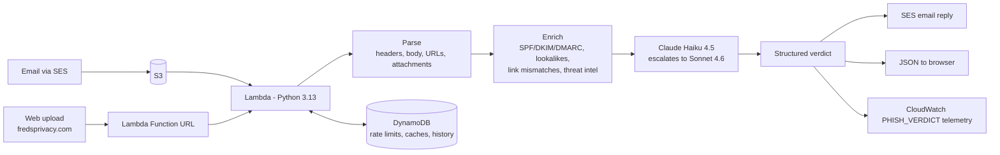

# Phish Analyzer

AI-assisted phishing email analysis, serverless end to end. Forward a suspicious
email to **check@fredsprivacy.com** or upload it at
**[fredsprivacy.com](https://www.fredsprivacy.com)** and get a structured verdict
in about ten seconds.

Built by Fred Pordum as a security engineering project. The design principle:
deterministic header analysis and threat intelligence establish the facts, an
AI model reads for social-engineering intent, and no single layer decides alone.

## Architecture



Two entry paths, one pipeline:

1. **SES path** — email arrives at check@fredsprivacy.com, SES drops the raw
   `.eml` in S3 and triggers the Lambda, which parses, enriches, analyzes, and
   replies by email.
2. **HTTP path** — the landing page POSTs a raw `.eml` to a Lambda Function
   URL; same pipeline, JSON response.

## What gets checked

- **Authentication** — SPF, DKIM, and DMARC, weighted the way mail servers
  actually trust them. DMARC is the senior signal because it reflects the
  sender's own published DNS policy; a DKIM failure on legitimately forwarded
  mail (common with forwarders, HR platforms, and ESPs) won't trigger a false
  alarm as long as DMARC still passes.
- **Sender alignment** — Reply-To and Return-Path domain mismatches against
  the From domain.
- **Lookalike domains** — checked against a watchlist of **38 major brands**
  (tech, banks, payment, shipping, government, retail) using two methods:
  - *Leet / digit substitution* (`paypa1.com`, `micr0soft.com`, `g00gle.com`,
    `amaz0n.com`) via a digit->letter normalization heuristic; `1` is tried as
    both `l` and `i`. This is the primary method — verified to catch the common
    real-world digit-swap attacks with zero false positives against legitimate
    domains.
  - *Unicode confusables* (e.g. Cyrillic lookalike characters for Latin ones)
    via `confusable_homoglyphs`, as a secondary layer. See Known limitations.
- **URLs** — extracted from plain text *and* HTML `href`s (where phishing kits
  hide targets), checked for shorteners, IP-literal hosts, and anchor-text
  mismatches (`<a href="evil.example">paypal.com</a>`).
- **URL reputation** — VirusTotal, urlscan.io, and PhishTank lookups (24h
  DynamoDB cache, capped at 3 URLs per email, fully fail-open). A hit is strong
  evidence; absence of a hit proves nothing, because fresh phishing URLs are
  rarely in any database yet — and the model prompt is told exactly that.
- **Attachments** — up to 5 attachments per email are inventoried (filename,
  type, size, SHA-256). Executable/script/smuggling-prone extensions (`.exe`,
  `.js`, `.iso`, `.lnk`, `.html`, `.svg`, `.xll`, ...) are flagged, and hashes
  are checked against VirusTotal's file database — **report lookup only; the
  file content is never uploaded anywhere**. Oversize attachments (>5 MB) are
  recorded but not hashed.
- **AI intent review** — Claude Haiku 4.5 reads the message against the hard
  signals for urgency framing, credential prompts, brand impersonation, and
  payment redirection. Uncertain verdicts optionally escalate to Claude
  Sonnet 4.6 for a second read.

## Abuse protections

- **Rate limiting** — 10 analyses/hour per sender email (SES) or source IP
  (HTTP), atomic DynamoDB counters with TTL, fail-open so an AWS blip never
  blocks legitimate mail.
- **Turnstile CAPTCHA** (optional) — when `TURNSTILE_SECRET_KEY` is set, the
  web path requires a valid Cloudflare Turnstile token in the
  `X-Turnstile-Token` header, verified server-side against Cloudflare's
  siteverify endpoint. Runs *before* the rate limiter so failed bots never
  burn a NAT'd office's shared budget, and rejects before any model cost is
  incurred. Fails open only if Cloudflare itself is unreachable (the rate
  limiter still backstops). The SES path is never gated — CAPTCHA only makes
  sense for browsers.
- **Loop/bounce protection** — our own replies, mailer-daemon/postmaster
  senders, RFC 3834 auto-responders, and bulk-precedence mail are dropped
  before analysis. `no-reply@` senders are deliberately *not* blocked (that's
  most of the legitimate mail people actually want checked).
- **Hostile-input hardening** — unknown charsets, malformed `.eml`
  attachments, header injection via RFC 2047 subjects, and sloppy model JSON
  all degrade gracefully instead of crashing the reply path.

## Per-submitter history (optional)

With `ENABLE_SUBMITTER_HISTORY=true`, the analyzer remembers (for 90 days)
that a given submitter has asked about a given sender domain before, and says
so in the reply: *"You've asked about this sender once before (last verdict:
likely phishing)."* Submitter identity is stored as a truncated SHA-256 hash,
never verbatim, and the whole feature is fail-open.

## Verdict output

Every analysis produces a structured verdict — tier
(`likely_phishing` / `suspicious` / `likely_legitimate` / `unknown`),
confidence, plain-English summary, indicators with severity, and a concrete
recommendation — delivered as an email reply or JSON, and logged as a
`PHISH_VERDICT` JSON line to CloudWatch for Insights queries and downstream
Wazuh ingestion. Log fields include auth results, lookalike method, attachment
counts, reputation hit counts, model used, and escalation status.

## Environment variables

Required:

| Var | Purpose |
|---|---|
| `ANTHROPIC_API_KEY` | Claude API key |
| `BUCKET_NAME` | S3 bucket where SES drops raw emails |
| `FROM_ADDRESS` | Verified SES sender for replies |
| `REGION` | AWS region for SES (e.g. `us-east-1`) |

Optional:

| Var | Purpose |
|---|---|
| `VIRUSTOTAL_API_KEY` | Enables VirusTotal URL **and attachment-hash** reputation |
| `URLSCAN_API_KEY` | Enables urlscan.io domain reputation |
| `PHISHTANK_ENABLED` / `PHISHTANK_APP_KEY` | Enables PhishTank lookups |
| `ENABLE_MODEL_ESCALATION` | `true` = Haiku -> Sonnet escalation on low confidence |
| `ESCALATION_CONFIDENCE` | Escalation threshold (default 70) |
| `ALLOWED_ORIGIN` | CORS origin (set to `https://www.fredsprivacy.com` in prod) |
| `TURNSTILE_SECRET_KEY` | Enables Turnstile CAPTCHA on the web path |
| `ENABLE_SUBMITTER_HISTORY` | `true` = per-submitter sender history |

## Testing

```
python -m pytest test_lambda_handler.py -v
```

**86 tests** (79 unittest-style + 7 pytest-style hardening regressions)
covering parsing, auth-signal weighting, lookalike detection, link mismatches,
URL and attachment reputation with caching, Turnstile gating, rate limiting,
submitter history, escalation logic, both entry paths, and hostile-input
regressions. All external services (DynamoDB, SES, S3, the Claude API, and
HTTP reputation calls) are mocked — the suite runs offline in under 3 seconds.

## Deployment

**Lambda.** Dependencies are vendored into a `package/` directory and zipped
together with the handler:

```bash
pip install anthropic beautifulsoup4 confusable_homoglyphs -t package/
cp lambda_handler.py package/
python makezip.py          # produces deploy.zip (handler at the zip root)
aws lambda update-function-code \
  --function-name phish-analyzer \
  --zip-file fileb://deploy.zip
```

The handler must sit at the **root** of the zip so Lambda can resolve the
`lambda_handler.lambda_handler` entrypoint. `confusable_homoglyphs` ships its
own JSON data files, so it must be present in the zip — bundling it via
`pip install -t package/` handles that.

New features need no DynamoDB schema changes: history and file-hash cache
entries live in the existing `phish-analyzer-rate-limits` table under distinct
key prefixes (`history#`, `filehash#`, `urlrep#`), all with TTL.

**Turnstile.** Create a widget at Cloudflare dashboard -> Turnstile
(hostnames `fredsprivacy.com` and `www.fredsprivacy.com`, Managed mode). You
get two keys:

> **Key handling.** The **site key** is public and goes in `TURNSTILE_SITE_KEY`
> in `index.html`. The **secret key** is private and goes *only* in the Lambda's
> `TURNSTILE_SECRET_KEY` env var — never in `index.html` or any client-side file.
> If the secret key is ever committed or served publicly, rotate it immediately
> from the widget's settings page. Leave both keys unset to run without CAPTCHA.

Deploy the backend secret before publishing the frontend site key: once the
Lambda requires a token, web uploads will 403 until the page that produces the
token is live.

**Frontend.** Set `ALLOWED_ORIGIN` to your canonical origin
(`https://www.fredsprivacy.com`) and ensure the bare domain redirects to it, so
every visitor lands on the single allowed origin. Redeploy `index.html` to
Cloudflare after editing the constants at the top of the `<script>` block.

## Roadmap

- [x] SPF/DKIM/DMARC weighting with DMARC-senior logic
- [x] HTML link extraction and anchor-text mismatch detection
- [x] URL reputation (VirusTotal, urlscan.io, PhishTank) with caching
- [x] Haiku -> Sonnet escalation on low-confidence verdicts
- [x] Structured verdict telemetry to CloudWatch / Wazuh
- [x] Turnstile CAPTCHA on the web upload path
- [x] Attachment analysis (extension flagging + VirusTotal hash lookups)
- [x] Per-submitter sender history
- [x] Leet/digit lookalike heuristic + expanded brand watchlist (38 brands)
- [ ] Broaden Unicode-confusable test coverage and confirm real-world coverage
- [ ] SES production access (operational — AWS console request, not code)
- [ ] Review escalation-rate telemetry after 30 days of production traffic

## Known limitations

- **Unicode confusable detection is a secondary layer, not yet fully verified.**
  The leet/digit method is the workhorse and is confirmed against common
  attacks; the `confusable_homoglyphs` arm is present as defense-in-depth but
  its real-world coverage across scripts still needs broader test cases (see
  Roadmap). Unicode homoglyph attacks that slip past it are frequently caught
  anyway by other signals (DMARC failure, link mismatches, URL reputation).
- **Reputation is asymmetric evidence.** A threat-intel hit is meaningful; the
  absence of one is not, and the system treats it that way by design.
- **Advisory, not authoritative.** Verdicts assist a human decision; they are
  not a guarantee, and the output says so.

## Privacy notes

Submitted emails are processed by AWS and analyzed by Anthropic's Claude.
Attachment contents are never uploaded to third parties — only SHA-256 hashes
are checked. Submitter identities in the history feature are stored hashed with
a 90-day TTL. Don't submit messages containing personal data you wouldn't share
with a cloud service.
