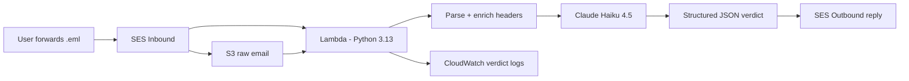

# Phish Analyzer

Serverless phishing email analyzer. Forward a suspicious email, get back a structured verdict with confidence score, indicators of compromise, and a recommendation in under ten seconds.

Combines deterministic header analysis (SPF, DKIM, DMARC, URL extraction, sender alignment, lookalike-domain detection, HTML link-mismatch detection) with LLM-based content review using Claude Haiku 4.5.

## Architecture



## How it works

1. User forwards a suspicious email as a `.eml` attachment to the check address.
2. Amazon SES receives the message and writes the raw RFC 822 source to S3 under the `inbound/` prefix.
3. SES triggers Lambda with message metadata; Lambda pulls the source from S3.
4. Lambda runs loop/bounce detection to reject its own replies, mailer-daemon bounces, RFC 3834 auto-responders, and bulk-mail markers before any analysis happens.
5. Lambda extracts deterministic signals: SPF/DKIM/DMARC results from the Authentication-Results header (with DMARC treated as the senior signal), From vs Return-Path vs Reply-To alignment, URLs from both text and HTML parts, anchor-text-vs-href link mismatches, and homoglyph/confusable lookalikes against a watchlist of commonly-impersonated brands.
6. Lambda passes parsed content and enriched signals to Claude with a structured prompt that defines a verdict hierarchy and explicitly handles ESP scenarios.
7. Claude returns JSON with a verdict tier, a 0-100 confidence score, indicators of compromise, and a user-facing explanation.
8. Lambda writes one structured JSON log line per verdict to CloudWatch (for Insights queries and future SIEM ingestion) and formats the verdict into an email reply sent back via SES.

## Tech stack

- AWS Lambda (Python 3.13) for serverless compute
- Amazon SES for inbound mail receiving and outbound replies
- Amazon S3 for raw email storage
- CloudWatch Logs for structured verdict telemetry
- Anthropic Claude (Haiku 4.5) for content analysis
- BeautifulSoup for HTML parsing (URL extraction, link-mismatch detection)
- `confusable_homoglyphs` for Unicode lookalike detection
- Cloudflare DNS for MX records and DKIM CNAMEs

## Design decisions

### Why hybrid Python plus LLM?

Python handles facts: what the headers literally say, what domains literally match, whether a URL's hostname differs from its anchor text, whether a sender domain is a Unicode lookalike of a watched brand. Cheap, deterministic, fast.

Claude handles judgment: what the body content means in context, whether framing matches known social engineering patterns (urgency, authority impersonation, payment redirection), what a non-technical user should do next.

Either layer alone produces weaker output. Python alone cannot reason about intent. Claude alone can be talked out of header anomalies by well-crafted prose, or can confidently misread headers it has no business interpreting. Splitting the work lets each layer handle what it is best at.

### Why Haiku, not Sonnet?

Cost per verdict matters when the input surface is open to the internet. Sonnet 4.6 runs roughly 2.8x the cost of Haiku 4.5 even with prompt caching, and output tokens dominate the bill since the JSON response is the bulk of the spend. Testing showed Haiku produces equivalent verdicts on the false-positive cases that drove the largest accuracy gains. Where Haiku was wrong, the fix was in the prompt or the enrichment logic, not the model.

Hybrid routing (Haiku default, Sonnet only on low-confidence verdicts) is on the roadmap if real-world accuracy requires it.

### Why structured verdicts?

The reply email is rendered from a JSON schema, not free-form text. This means:

- The verdict tier is always one of three known values: `likely_phishing`, `suspicious`, `likely_legitimate` (plus `unknown` for service failures)
- Confidence scores are bounded 0-100
- Indicators are a list, not a paragraph

Free-form output is unparseable at scale. Structured output lets the same verdict feed an email reply, a CloudWatch log entry, a future SIEM ingestion pipeline, and a future dashboard without re-parsing model prose.

### Why DMARC is the senior signal

A DMARC pass means the sender's own DNS policy validated the message via SPF or DKIM alignment. That makes DMARC outcome the authoritative legitimacy signal — stronger than raw SPF or DKIM results in isolation. DKIM failure with DMARC pass is benign and routine for forwarded mail, HR platforms, marketing ESPs, and any third-party sender. The enrichment scoring and the model's system prompt both encode this hierarchy explicitly to prevent the false-positive class described in the case studies below.

## Verdict telemetry

Every verdict produces one structured JSON log line to CloudWatch with the fields needed for trend analysis and downstream SIEM ingestion:

```json
{
  "event": "verdict",
  "ts": 1735000000,
  "message_id": "abc123...",
  "sender_domain": "example.com",
  "return_path_domain": "bounce.example.com",
  "spf": "pass",
  "dkim": "pass",
  "dmarc": "pass",
  "dmarc_policy": "reject",
  "url_count": 4,
  "link_mismatch_count": 0,
  "lookalike_brand": null,
  "verdict": "likely_legitimate",
  "confidence": 92,
  "indicator_count": 1
}
```

This format supports CloudWatch Insights queries directly (verdict distribution over time, top sender domains by phish count, DMARC pass/fail ratios) and is structured for clean ingestion into Wazuh once the SIEM pipeline lands.

## Case studies: false positives and what they taught me

Real emails that the analyzer initially handled incorrectly. Each one drove a meaningful architectural change.

### Case 1: JetBlue recruiting email (SAP SuccessFactors)

A legitimate JetBlue recruiting email sent through SAP SuccessFactors was flagged as `suspicious` with DKIM failure cited as the primary indicator of compromise.

**Why the original logic was wrong.** The message had DMARC pass with `p=REJECT`. That is a stronger trust signal than raw DKIM alignment. If a domain owner publishes `p=REJECT`, any non-aligned mail is dropped by receiving servers before it reaches an inbox. The fact that the message arrived at all means it passed alignment downstream of the original SuccessFactors hop. Flagging DKIM failure as HIGH severity in that scenario treats authentication headers as a flat checklist instead of a hierarchy.

**Fix.** Rewrote the enrichment scoring to treat DMARC outcome as the senior signal. DMARC pass with strict policy now downgrades DKIM-failure severity from HIGH to INFO and adds an explicit "legitimate ESP pattern" note for the model. DKIM failure with DMARC fail or no DMARC policy remains HIGH.

**Lesson.** Authentication header signals are not independent. Treating them as a flat checklist produces false positives on most legitimate corporate email, because most corporate email is sent through an ESP.

### Case 2: Sonic.com marketing email (Salesforce Marketing Cloud)

Same pattern. Legitimate marketing email from Sonic, sent through Salesforce Marketing Cloud, with a non-aligned DKIM signature but DMARC pass under the published policy. Initial verdict: `suspicious`.

**Fix.** Same code path as Case 1.

**Lesson.** ESPs are the rule, not the exception, for corporate mail. An analyzer that does not understand the ESP pattern will alarm on most of an enterprise inbox, which is the failure mode that kills user trust faster than missing a real phish.

### Case 3: noreply false-positive class (loop-prevention false drop)

Early loop-prevention logic dropped any submission whose sender local-part matched `noreply@`, `no-reply@`, `donotreply@`, or `do-not-reply@`. The intent was to catch the analyzer's own outbound, but those patterns are also the standard sender format for every legitimate transactional email — banks, airlines, SaaS notifications, the exact mail users most often want analyzed.

**Fix.** Tightened the bounce-pattern list to true system addresses only (`mailer-daemon@`, `postmaster@`, `bounces@`, `bounce@`). Self-reply detection is now handled by the explicit `FROM_ADDRESS` and own-domain check earlier in the function, which is a stronger and more specific guard than a local-part substring match.

**Lesson.** Loop prevention is a class of input filter, and input filters that over-match silently destroy real signal. The right guard is identity-based (is this *our* address?), not pattern-based.

## Security and cost controls

- IAM scoped to least privilege; deny policy blocks EC2, Bedrock, SageMaker, and other compute services unrelated to the function's purpose
- Anthropic API spend capped at $10 per month with alerts at $6 and $8
- AWS budgets at $0.01 (zero-spend tripwire) and $5 (operational ceiling) with email alerts
- All credentials live in Lambda environment variables; nothing in source
- Loop prevention rejects submissions from the analyzer's own address/domain, true bounce senders (`mailer-daemon`, `postmaster`, `bounces`), RFC 3834 auto-responders, and `Precedence: bulk/junk/list` headers — without over-matching on legitimate `noreply@` transactional mail
- Errors caught at the API and SES boundaries; an Anthropic API failure returns a "service temporarily unavailable, treat with caution" reply rather than crashing the function
- All error paths use the standard `logging` module (including `logger.exception` for unexpected errors, which captures full tracebacks to CloudWatch) for consistent observability

## Status

MVP complete and deployed. Currently running in SES sandbox (recipient address whitelist) pending rate limiting work before requesting production access.

**What's done**
- Core SES → S3 → Lambda → Claude → SES reply pipeline
- DMARC-senior enrichment scoring with ESP-aware handling of DKIM-fail-with-DMARC-pass
- HTML link mismatch detection (anchor text vs href hostname) via BeautifulSoup
- Lookalike/homoglyph detection on sender domain against a watchlist of commonly-impersonated brands via `confusable_homoglyphs`
- URL extraction from both text and HTML bodies, deduplicated
- Structured JSON verdict logging to CloudWatch for Insights queries and future SIEM ingestion
- Loop prevention tightened to eliminate noreply false-drops
- Standardized logging across the function (no stray `print()` calls)

## Roadmap

**Near term**
- Rate limiting via DynamoDB per-sender counter with TTL

**Medium term**
- SES production access (requires rate limiting first)
- URL reputation enrichment via VirusTotal, URLScan.io, and PhishTank
- Wazuh SIEM integration: CloudWatch Logs pulled into Wazuh via the native AWS module, with custom decoders for the verdict JSON schema, MITRE ATT&CK-mapped detection rules (T1566.001, T1566.002, T1534), and a dashboard for verdict distribution and indicator trends
- Landing page and submission portal at fredsprivacy.com

**Long term**
- Hybrid model routing (Haiku default, Sonnet on low-confidence verdicts)
- Web frontend for drag-and-drop `.eml` uploads

## License

MIT
